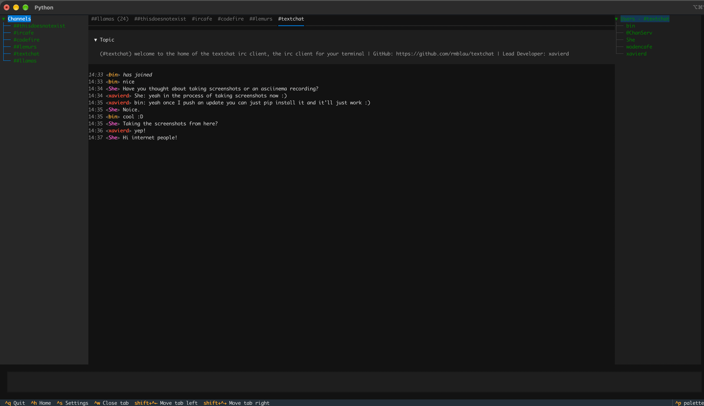

# Textchat

Textchat is a terminal IRC client built with [Textual](https://textual.textualize.io/) and [python-irc](https://github.com/jaraco/irc). It supports multiple saved IRC or ZNC profiles, channel tabs, private messages, member lists, nick completion, topics, and common IRC commands.

## Install

```bash
python -m pip install textchat
textchat
```

On first launch, add a server or ZNC profile. On later launches, Textchat shows a network picker rather than connecting automatically.

## Highlights

- Multiple saved IRC and ZNC network profiles
- Optional TLS and SASL authentication
- Channel and private-message tabs
- Channel-scoped member lists and nick completion
- Clickable nicknames, WHOIS, and private messages
- IRC topics, unread tab markers, chat colours, and URL detection
- Commands including `/join`, `/part`, `/msg`, `/whois`, `/nick`, and `/kick`

## Development

```bash
git clone https://github.com/rmblau/textchat.git
cd textchat
python -m pip install -e .
```

## Screenshots

